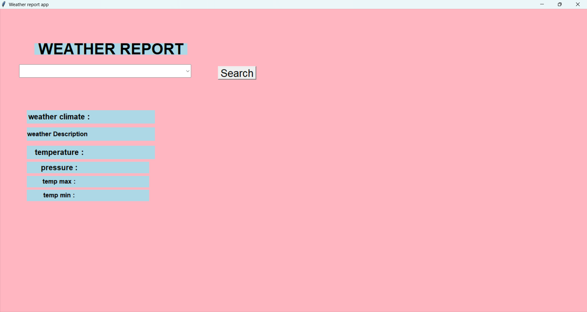
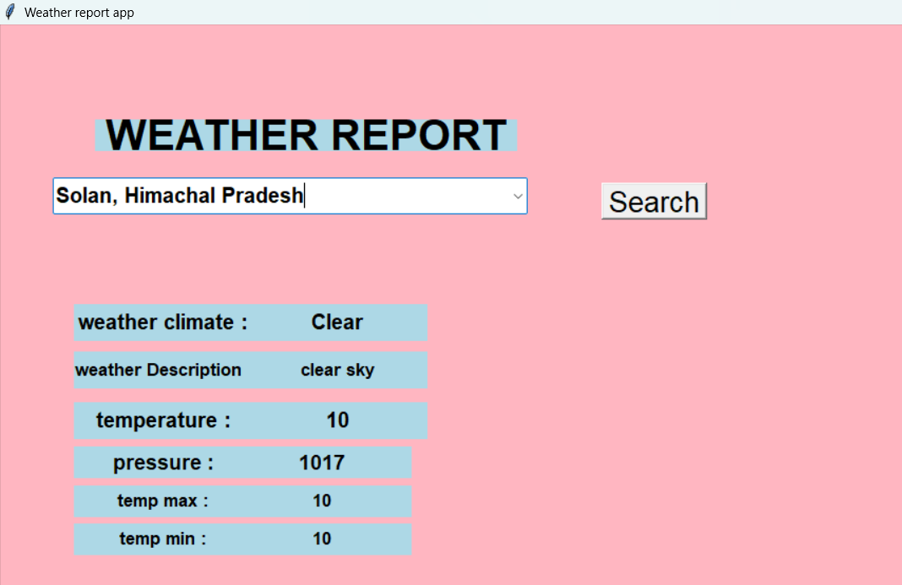

Weather Report Application

A desktop-based Weather Report Application built using Python, Tkinter, and the OpenWeatherMap API.
The application retrieves real-time weather information and displays it through a clean and simple graphical user interface.

Table of Contents

Overview

Features

Technologies Used

Application Workflow

Installation & Setup

Project Structure

Screenshots

Learning Outcomes

1. Overview

This Weather Report Application enables users to select a city and instantly fetch weather details such as temperature, pressure, and weather conditions.
The data is retrieved from the OpenWeatherMap API and displayed within a Tkinter-based GUI.

2. Features

Tkinter-based user interface

Real-time weather data retrieval

Displays:

Weather condition

Weather description

Temperature (Celsius)

Minimum and maximum temperature

Pressure

Dropdown menu for selecting cities

Lightweight and easy to run locally

3. Technologies Used
Technology	Description
Python	Core programming language
Tkinter	GUI framework for desktop apps
Requests	Used to make API calls
OpenWeatherMap API	Source of live weather data
JSON	Data format received from API

4. Application Workflow

User selects a city from the dropdown.

On clicking "Search", a request is sent to the OpenWeatherMap API.

API returns weather details in JSON format.

Temperature values (in Kelvin) are converted to Celsius.

Relevant information is displayed on the Tkinter window.

5. Installation & Setup
Step 1: Install Dependencies

Run the following command:

pip install requests

Note: Tkinter is included with most Python installations.

Step 2: Get OpenWeatherMap API Key

Create an account and generate an API key:
https://openweathermap.org/

Replace the placeholder in your script:

data = requests.get("https://api.openweathermap.org/data/2.5/weather?q=" + city + "&appid=YOUR_API_KEY").json()

Step 3: Run the Application
python your_file_name.py

6. Project Structure
weather-app/
│── weather.py               # Main application script
│── README.md                # Project documentation

7. Screenshots

### Home Screen

### Result Screen

Example (placeholder):

8. Learning Outcomes

This project demonstrates understanding of:

Tkinter GUI development

API integration in Python

JSON parsing and data extraction

Event-driven programming

Temperature conversion logic

Building user-friendly desktop applications